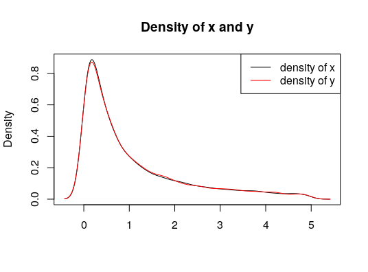
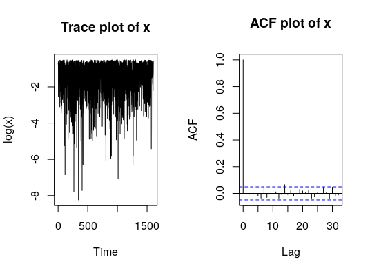
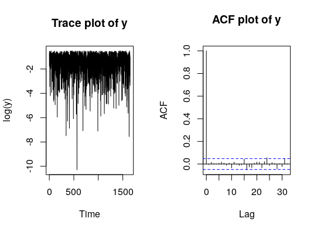

# Gibbs sampler

As it was mentioned in the [Introduction to the Bayesian statistics](../README.md) to derive the posterior can be very cumbersome, if not impossible. However, they can be approximated by _simulation-based methods_, such as

* _Discrete approximations_ of the posterior distribution on a grid of parameters $${\theta_1, \dots, \theta_G}$$ by $$\hat{p}(\theta_i|y) = \frac{p(\theta_i|y)}{\sum_{i = 1}^Gp(\theta_i|y)} = \frac{p(y|\theta_i)p(\theta_i)}{\sum_{i = 1}^Gp(y|\theta_i)p(\theta_i)}$$. However, as this solution works only in very few dimensions with well selected grid and analytically available likelihood, I won't describe it more.

* _Gibbs sampler_, which is a very powerful tool to estimate the posterior. This is described in this site through a replication of Section 3 of the paper of Casella and George (1992).

  For a more realistic example, please check my other writing following the link:



## Prerequisite

To apply Gibbs sampler, one needs to be able to decompose the posterior distribution $$p(\theta_1, \dots, \theta_p|y)$$ into the components with full conditional distributions, which are easy to sample from.  In other words, one should be able to write up the following:

$$p(\theta_1|\theta_2, \dots, \theta_p,y)$$

$$p(\theta_2|\theta_1,\theta_3, \dots, \theta_p,y)$$

$$\vdots$$

$$p(\theta_p|\theta_1, \dots, \theta_{p-1},y)$$,

which are easier to sample from than the original posterior distribution.

## Theory

By following the algorithm

For $$s = 1, \dots,S$$:

* Sample $$\theta_1^{(s)} \sim p(\theta_1|\theta_2^{(s-1)}, \dots, \theta_p^{(s-1)},y)$$
* Sample $$\theta_2^{(s)} \sim p(\theta_2|\theta_1^{(s-1)}, \dots, \theta_p^{(s-1)},y)$$
* $$\vdots$$
* Sample $$\theta_p^{(s)} \sim p(\theta_p|\theta_1^{(s-1)}, \dots, \theta_{p-1}^{(s-1)},y)$$

the resulted dependent sequence of draws $$\theta^{(1)}, \dots, \theta^{(S)} $$ has a sampling distribution which approaches the posterior distribution as $$s \rightarrow \infty$$.  

Side note: given that every $$\theta^{(s)}$$ depends only on the previous draws $$\theta^{(s-1)}$$, the Gibbs sampler represents an example of [Markov Chain Monte Carlo (MCMC)](https://en.wikipedia.org/wiki/Markov_chain_Monte_Carlo) methods.

Of course, for the Gibbs sampler it "takes some time" to get to the right posterior distribution. How long it takes, depends on the correlation of the marginal posteriors. If we would like to keep only the samples distributed following the posterior distribution, we should take a look at the autocorrelation and the trace plots of the samples, to find the number of samples after the distribution of them became stationary. The draws before that point can be omitted ("burn-in" period).

## A very simple example

To check whether the Gibbs sampler really works, the following small example (_Example 2 in [Casella (1992)](#resources)_) may help:

_Suppose X and Y have conditional distributions that are exponential distributions restricted to the interval (0,B), that is,_
$$f(x | y) \propto ye^{-yx},\text{  } 0<y<B<\infty$$

$$f(y | x) \propto xe^{-xy},\text{  } 0<x<B<\infty$$

_where B is a known positive constant._

From these, the marginals are not easily calculable. But the Gibbs sampler is here to save the situation.

Setting the initial values and the number of draws _n_ and the known positive constant _B_:

```R
x <- c(0.5) 
y <- c(0.5)
n <- 10000
B <- 5
```

Draw from each conditional _n_ sample after each other. So first draw _y conditionally on the previous x_, then draw _x conditionally on the previous y_. 

Note: in both cases the draws should be restricted to be smaller than the set _B_. Why? You will see in the next section.

```R
set.seed(2019)
for(i in 1:n){
  # Draw from y conditional x
  curr_y <- rexp(1, rate = tail(x, 1))
  # Update y if it is < B
  if(curr_y < B){
    y <- c(y, curr_y)
  }
  # Draw from x conditional y
  curr_x <- rexp(1, rate = tail(y, 1))
  # Update x if it is < B
  if(curr_x < B){
    x <- c(x, curr_x)
  }
}
```

### Results



What we can see, exactly what we hoped to see: both _x_ and _y_ follows an exponential distribution.

### Check for convergence





As said earlier, these plots helps to identify the needed length of the _burn-in period_. However, as from the trace plots we can see, the process got stationary immediately. From the ACF plots we can as well, that there is no autocorrelation at all, hence, no need for a burn-in period.

## Does the Gibbs sampler works always?

Well, if I asked the question like that, the answer is probably a 'No'. But how can one break the Gibbs sampler?
This question is examined in the two examples provided [here](./break_sampler.md) and [here](./break_sampler_explained.md).

## Resources

* Casella, George, and Edward I. George. "Explaining the Gibbs sampler." *The American Statistician* 46.3 (1992): 167-174.
* For this section I used heavily our notes and home assignments of the course _Advanced Topics in Financial Econometrics_ hold by [Gregor Kastner](https://www.wu.ac.at/statmath/faculty-staff/faculty/gkastner) during the summer semester of 2019 in the Quantitative Finance Master Program of the Business University of Vienna.