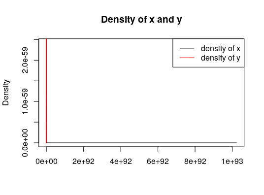
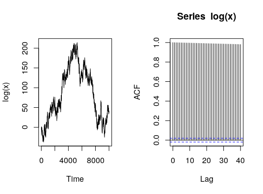
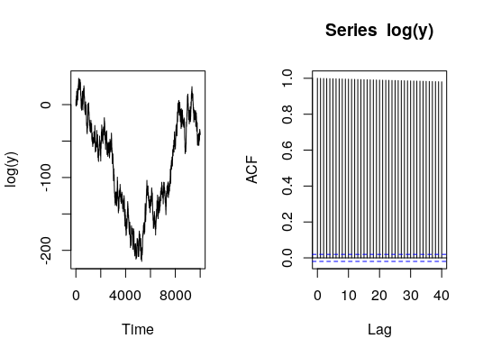
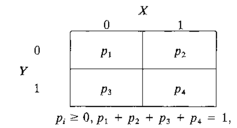
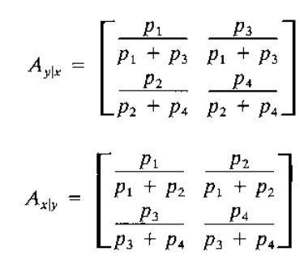
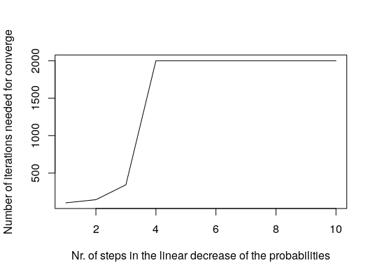

# How to break the Gibbs sampler

## Example I

Let us consider the previous example, but without having the constant _B_ as "filter", i.e. drawing _x_ and _y_ using the following code:

```R
set.seed(2019)
for(i in 1:n){
  # Draw from y conditional x
  curr_y <- rexp(1, rate = tail(x, 1))
  # Update y
  y <- c(y, curr_y)
  # Draw from x conditional y
  curr_x <- rexp(1, rate = tail(y, 1))
  # Update x
  x <- c(x, curr_x)
}
```



Well, from this plot we don't know much. 





From the analysis of the convergence it is clear, that something went wrong. The series are not stationary at all, meaning that the drawings "didn't find their distribution". Looking at the ACF graphs, it is no wonder. There is enormous autocorrelation, leading to a series of drawings which converge very, very, very sloooowly to their "right" distribution. But why? Why was the constant _B_ so important in the convergence?

Everything is clarified using through the _Example II_.

## Example II

To understand better, why it has happened, let us consider an extended version of another example of [_Section 3_ of Casella (1992)](#resources).

Let's consider a $$2 \text{ x } 2$$ matrix, representing the _joint distribution_ of two Bernoulli random variables $$X$$ and $$Y$$:



If we apply Gibbs sampler with the given joint distribution, i.e. drawing first $$X$$ based with probabilities given by the state of the previous $$Y$$, then drawing $$Y$$ based on the state of this drawn $$Y$$, the distribution of $$X$$'s and $$Y$$'s should converge to their _joint probabilities_, represented by the previous table. 

To do so, we first need the _conditional probabilities_ of moving to $$Y$$ from $$X$$, which is the following:



This is straightforward to calculate given that the marginal of $$X$$ and $$Y$$ are respectively given by

$$f_x = [f_x(0) \text{    } f_x(1)] = [p_1 + p_3 \text{    } p_2 + p_4]$$

$$f_y = [f_y(0) \text{    } f_y(1)] = [p_1 + p_2 \text{    } p_3 + p_4]$$.

By let's say, having a _joint distribution table_ of 

$$ \begin{bmatrix}
p_1 & p_2\\ p_3 & p_4 \\
\end{bmatrix}  = \begin{bmatrix}
0.43 & 0.05\\\
0.4 & 0.12 \\
\end{bmatrix} $$

we have the joints 

$$A_{y|x} =  \begin{bmatrix}
\frac{p_1}{p_1 + p_3} & \frac{p_2}{p_1 + p_3}\\ \frac{p_2}{p_2 + p_4} & \frac{p_4}{p_2 + p_4}\\
\end{bmatrix}  = \begin{bmatrix}
0.43 & 0.05\\\
0.4 & 0.12 \\
\end{bmatrix} $$

and 

$$A_{y|x} =  \begin{bmatrix}
\frac{p_1}{p_1 + p_3} & \frac{p_2}{p_1 + p_3}\\ \frac{p_2}{p_2 + p_4} & \frac{p_4}{p_2 + p_4}\\
\end{bmatrix}  = \begin{bmatrix}
0.43 & 0.05\\\
0.4 & 0.12 \\
\end{bmatrix} $$.

By implementing this in $$R$$ , we can see that, indeed, the Gibbs sampler works: 

```R

```

### Now, let's break this simple Gibbs sampler.

As an initial matrix, let us consider an $$n \text{ x } m$$ matrix, representing the joint distribution of the $$2$$ Bernoulli variables $$X$$ and $$Y$$ with $$n$$ and $$m$$ states, respectively:

```R
# Nr of categories of X and Y
n <- 3
m <- 3
  
set.seed(2019)
# Create the joint conditional mmatrix
probs <- runif(n*m-1)/(n*m-1)
probs <- c(probs,1 - sum(probs))
probs <- rep(1/(n*m),n*m)
df <- as.data.frame(matrix(probs, n * m, ncol = n, nrow = m))
colnames(df) <- 1:n
rownames(df) <- 1:m
origin_df <- df
```

The code above gives us a uniform matrix with equal probabilities to move from each $$n$$ states of $$X$$ to each $$m$$ states of $$Y$$ and from there moving to each $$n$$ states of $$X$$ with equal probabilities.

$$\begin{bmatrix}
1/9 & 1/9 & 1/9\\
1/9 & 1/9 & 1/9\\
1/9 & 1/9 & 1/9\\
\end{bmatrix} $$

We know from above, that the Gibbs sampler can pretty quickly estimate this _joint distribution_ by drawing sequentially from the _conditionals_. However, let's see what happens if we alter this table sequentially, step-by-step to the following _joint distribution_:

$$\begin{bmatrix}
1e-7 & (1-4*1e-7)/4 & 1e-7\\
(1-4*1e-7)/4 & 1e-7 & (1-4*1e-7)/4\\
1e-7 & 1e-7 & (1-4*1e-7)/4\\
\end{bmatrix}$$,

in other words, to a _joint distribution_ which has very tiny ($$1e-7 = 0.0000001$$) probabilities in given places. 

Below, we can see the number of iterations needed for convergence (where the convergence is defined by the maximum absolute difference between the _joint distribution_ and the current distribution of the draws):



It is straightforward, that altering to the _joint distribution_ with very low probabilities breaks the Gibbs sampler very fast. We needed to make only 4 steps in the direction of this new _joint distribution_ from the _uniform joint distribution_ to get sample from the Gibbs sampler, which do not converge at all to the desired _joint distribution_. 

To reproduce this example and generate this graph, please refer to this [script](break_sampler_explained.R).

## Explanation

If you read until here, you probably would like to know why did that happen both in this example and in the [previous one](./break_sampler.md) as well.

The explanation is the same: the Gibbs sampler stuck in a never ending circular drawing. It is more obvious in the case of the second example, where we have the following _conditional distributions_ in case of the table with the low probabilities:

MISSING


## Resources

- Casella, George, and Edward I. George. "Explaining the Gibbs sampler." *The American Statistician* 46.3 (1992): 167-174.
- For this section I used heavily our notes and home assignments of the course _Advanced Topics in Financial Econometrics_ hold by [Gregor Kastner](https://www.wu.ac.at/statmath/faculty-staff/faculty/gkastner) during the summer semester of 2019 in the Quantitative Finance Master Program of the Business University of Vienna.