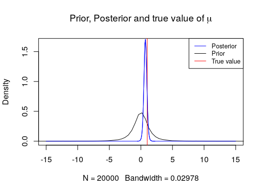

# Bayesian statistics

This article is intended to summarize the  most important concepts of the mysterious field of Bayesian statistics.

My hope is, that with the help of my explanations and the materials I link here, I will be able to spread the amazing view, how a bayesian statistician sees the world.

# Table of contents

- Introduction to the Bayesian statistics _- That is where you are currently._
- [Gibbs sampler - Introductory example](Gibbs_sampler/README.md)
- [Realistic example for a Gibbs sampler](Gibbs_sampler/real_gibbs_sampler.R)
  - [Metropolis-Hastings within a Gibbs sampler](MH_within_Gibbs/README.md)
- [Bayesian regression](Bayesian_regression/README.md) 

# Bayes' rule

$$P(A|B) = \frac{P(B|A)P(A)}{P(B)}$$

Yes, this is it. This is the rule on which a whole new kind of statistical thinking is based. Why is that so revolutionary?  To understand this, let's have a quick recap about how frequentist think about statistics.

# Frequentist approach

The main weapon of the [frequenstist](#Resources) statistics is the Null Hypothesis Significance Testing (NHST). This method of statistical inference is probably known for everybody as this is, even if it is thoroughly criticized, used in many fields, even in the academia. NHST works based on the concepts of significance testing developed by [Fisher (1934, 1955, 1959)](#Resources) and the critical rejection regions introduced by [Neyman & Pearson (1928)](#Resources).  Specifically, the probability of the observed, or more extreme result is calculated given that the null hypothesis ($$H_0$$, which often denotes the cases of _"no effect"_, _"mean = 0"_, _"the populations have equal mean"_ etc.) is true. This probability is denoted by the $$p$$-value and calculated with the help of the _t-statistic_ of the given test, which has some kind of distribution (often _t-distribution_). 

Given that the $$p$$-value is smaller than the chosen level of significance_ (usually set to $$0.05$$ or $$0.01$$), we can conclude something like this:

__"The probability of observing this, or more extreme data under the true $$H_0$$ is true, is very small."__

Here, we can already see, that there is nothing about the probability of the _alternative hypothesis_ $$H_A$$ (which is the hypothesis assumed to be true if $$H_0$$ is false, usually the opposite of $$H_0$$).

Hence, the $$p$$-value answers the following question:

__"Given that H_0 is true, what is the probability of this (or more extreme) data?"__

Given that $$H_0$$ is often a hypothesis for a parameter of a distribution (such as _mean_, _variance_, _proportion in the population_, etc. For a nice cheat sheet about, which hypothesis test is when to use with which test-statistic please refer to my [mind map about statistics](), or [here](https://www.dummies.com/education/math/statistics/handling-statistical-hypothesis-tests/) or [here](https://dacg.in/2018/11/17/statistical-test-cheat-sheet/)), let's denote it with $$\theta$$. Furthermore, denote the data what we have by _D_. Hence, we can write the probability what we have got as $$P(D|\theta)$$. 

### Example in plain english

Imagine, that you would like to predict the price of a house by applying linear regression.  A house can have many features, let's see _number of rooms_, _number of floors_ etc. For this example, let's consider the coefficient $$\beta$$ connected with the _number of rooms_. The $$H_0$$ is that this coefficient is equal to $$0$$, i.e. $$\beta = 0$$. After applying the linear regression on that dataset, you get a value for $$\beta$$, let's say $$2.5$$ and a $$p$$-value $$0.021$$ connected with that. Based on the above, we already know what the $$p$$-value tells us in this case: the probability of the given dataset under $$H_0$$ is $$0.021$$, i.e. $$2.1\%$$. In other words, it has $$2.1\%$$ probability to get this dataset with $$\beta = 2.5$$ given that the $$\beta = 0$$ ($$H_0$$). As this is below the significance level $$5\%$$, we can reject the $$H_0$$, so that $$\beta = 0$$. 

Great. But do we know anything  about $$\beta$$? Do we know if this $$\beta = 2.5$$ is a valid value? The answer is a huge __NO__!

# Bayesian approach

In the example above we could see what is the problem with NHST. In other words, the following can be said: nice that we have $$P(D|\theta)$$, but we would like to know the probability of $$\theta$$ given the data _D_, so $$P(\theta|D)$$, right?

Let's recall the Bayes' rule:

$$ P(A|B) = \frac{P(B|A)P(A)}{P(B)} $$,

and let's substitute _A_ by $$\theta$$ and _B_ by _D_. Then we have 

$$ P(\theta|D) = \frac{P(D|\theta)P(\theta)}{P(D)} $$,

which gives the way to calculate the required probability. Indeed, it is the only way to make statistical inference about the parameter $$\theta$$ conditional on data _D_.  

Let's elaborate more what we can see above by describing each element of the equation:

* $$P(\theta|D)$$: _posterior distribution_, the distribution of the parameter(s) $$\theta$$ given the data $$D$$.
* $$P(D|\theta)$$: _likelihood function_ of the data $$D$$. In case of i.i.d. (independent, identically distributed) observations, the likelihood function can be received by $$\prod_{i = 1}^n f(x)$$, where $$f(x)$$ denotes the distribution function of each $$n$$ observation.
* $$P(\theta)$$: _prior distribution,_ distribution which includes all our prior knowledge/believes about the parameter $$\theta$$. 
* $$P(D)$$: _marginal likelihood_, which is usually considered as a constant, so we can set the _posterior_ proportional to the numerator of the product of the _prior_ and the _likelihood_.

__Important__ that in this case, we got a probability distribution of the parameter(s) $$\theta$$ given the data $$D$$, not a point estimate. Point estimate is, of course, possible by

* _posterior mean_: the mean of the posterior distribution,
* _posterior median_: the median of the posterior distribution,
* _Maximum A Posteriori (MAP)_ estimation: maximum of the posterior distribution (asymptotically similar to the maximum-likelihood estimator).

There are two more definitions, which are useful to know:

* _Bayesian credible intervals_: this is quasi the Bayesian equivalent of the confidence interval, denoting the region $$C(y)$$ under the posterior distribution of the parameters, where the parameters lie with $$1 - \alpha$$ probability. In other words, $$C(y)$$ is defined by $$p(\theta \in C(y)|y) = 1- \alpha$$.
* _Highest posterior density (HPD)_: denotes the region $$C(y)$$ of the posterior distribution, where it has the highest values. In other words $$C(y) = {\theta:p(\theta|y)\geq k_\alpha}$$, where $$k_\alpha$$ is defined by the equation presented by the _Bayesian credible interval_.

# Comparison

#### Advantages of the Bayesian approach over the frequentist one

* We can answers question like "What is the probability that the parameter $$\theta$$ lies within/outer a given interval/equal to a given value based on the data?"
* We can avoid a bunch of misinterpretation of the _p_-value. Of course, "_p_-hacking" does not come into the play at all.

#### Disadvantages of the Bayesian approach over the frequentist one

* To get the posterior correctly is often cumbersome, if not impossible.

* The selection of the _prior_ distribution(s) matters a lot!! However, one can select noninformative priors, such as:

  * for _location models_, i.e. $$y \sim p(y-\theta)$$ $$\rightarrow$$ flat prior $$p(\theta) \propto 1$$,
  * for _scale models_, i.e. $$y \sim \frac{1}{\theta}p(\frac{y}{\theta})$$ $$\rightarrow$$ log-transform of flat prior $$p(\theta) \propto \frac{1}{\theta}$$,
  * or selection of a translational invariant prior, i.e. Jeffreys prior, defined by $$p(\theta) \propto |F(\theta)|^{\frac{1}{2}}$$with $$F(\theta) = V(\frac{\partial log p(y|\theta)}{\partial \theta})$$ denoting the Fisher Information,

  or some _conjugate prior_ mimicing the likelihood structure within the prior to receive _posteriors_ within the same parameterized distribution family as the _priors_. 

# Example 

Assume that our data $$y$$ consists of $$n$$ i.i.d. normal variables with mean $$\mu$$ and variance $$\sigma^2$$,i.e. $$y_i \sim N(\mu,\sigma^2) $$. Furthermore, let $$ \theta = (\mu,\sigma^2)$$, meaning we assume that both mean and variance are unknown and random.

Thus we have a joint prior distribution, which we can decompose in conditional and marginal:

$$ p(\mu,\sigma^2) = p(\mu|\sigma^2)p(\sigma^2), $$

As priors, we now choose:

* $$p(\mu|\sigma^2) \sim N(0,\sigma^2)$$
* $$p(\sigma^2) = \frac{1}{(\sigma^2)^2}exp\big\{-\frac{1}{\sigma^2}\big\} \sim \mathcal{IG}(1,1)$$ (an exponential $$\mathcal{E}(1)$$ on precision $$\sigma^{-2}$$)

After putting all these priors and the likelihood into the [Bayes' rule](#Bayesian approach) the following joint posterior is given:

$$ p(\mu,\sigma^2 | y)  \propto p(\mu|\sigma^2,y) \times p(\sigma^2|y)    $$

where $$p(\mu|\sigma^2,y)$$ is the conditional (posterior) distribution, and $$p(\sigma^2|y)$$ the marginal (posterior) distribution.
This, gives:

$$ p(\mu,\sigma^2 | y) \propto \frac{1}{\sigma}\exp\bigg\{-\frac{1}{2\sigma^2/(n+1)}\bigg(\mu - \frac{n\bar{y}}{n+1}\bigg)^2\bigg\} \times (\sigma^2)^{-\frac{n+2}{2}-1}\exp\bigg\{-\frac{1}{2\sigma^2}\bigg(2+s^2+\frac{n}{n+1}\bar{y}^2\bigg)\bigg\}  $$

which is the product of a conditionally normal distribution

$$ p(\mu|\sigma^2,y) \sim N\bigg(\frac{n}{n+1}\bar{y}, \frac{1}{n+1}\sigma^2\bigg),  $$

and an inverse gamma distribution,

$$p(\sigma^2 | y) \sim \mathcal{IG}\bigg(\frac{n+2}{2}, \frac{1}{2}\bigg(2+s^2+\frac{n}{n+1}\bar{y}^2 \bigg)\bigg).$$

Note that the marginal posterior distribution of $$\mu$$ is a non-standardized Student's $$t$$ distribution:
$$ \mu|y \sim \mathcal{T}_{n+2}\bigg(\frac{n}{n+1}\bar{y}, \frac{2+s^2+\frac{n}{n+1}\bar{y}^2}{(n+1)(n+2)}\bigg)$$.

### The same in plain english

Let's assume that we have a vector with values each normally distributed with unknown mean and variance (the same for all value). 

Our _prior_ knowledge/expectation about these parameters are given by the prior distributions, i.e. we expect the mean of the values be normally distributed with $$0$$ mean and with variance, which expected to follow an inverse-gamma distribution (which is identical with an exponential distribution on the precision [:= inverse of the variance]).  If one would have got very strong knowledge/expectation about their value, so called _shrinkage priors_ (more about them [here](Bayesian_regression/README.md)), or in case of no prior knowledge/expectation about their distribution the above described noninformative priors could have been used. 

After some (a lot) computation, we receive the _joint posterior distribution_ of the parameters mean and variance, which is a product of a normal distribution (which is conditional on the variance) and an inverse-gamma distribution. From this joint posterior, the marginal posterior of the mean can be derived by integrating the joint posterior out on the variance. This procedure give a non-standardized Student's _t_ distribution with the parameterization described above.

Hence, even without knowing the real value of the mean and the variance, with the given priors we can infer about these parameters, as we have their distribution.

Furthermore, recognize, that a prior _normal - inverse-gamma_ gave us a posterior _normal - inverse-gamma_, so we can talk about a _conjugate prior_.

# Conclusion

...seeing the results of this simple example, one can imagine, how cumbersome is to derive these posteriors. However, there is a [list](https://en.wikipedia.org/wiki/Conjugate_prior) on the Wikipedia with the conjugate priors of the most important distribution, included the posteriors received by using them.

However, in many cases it is impossible or very difficult to derive such close forms of the _posteriors_. Here comes the [__Gibbs sampler__](Gibbs_sampler/README.md) into the picture. 

# Resources

* Disclaimer: the section about the Frequentist approach is based on the  following website: <https://www.ncbi.nlm.nih.gov/pmc/articles/PMC5635437/> 
* Fisher RA: Statistical Methods for Research Workers. (Vol. 5th Edition). Edinburgh, UK: Oliver and Boyd.1934.
* Fisher RA: Statistical Methods and Scientific Induction. *Journal of the Royal Statistical Society, Series B.* 1955;17(1):69–78.
* Fisher RA: Statistical methods and scientific inference. (2nd ed.). NewYork: Hafner Publishing,1959
* Neyman J, Pearson ES: On the Use and Interpretation of Certain Test Criteria for Purposes of Statistical Inference: Part I. *Biometrika.*1928;20A(1/2):175–240. 10.3389/fpsyg.2015.00245